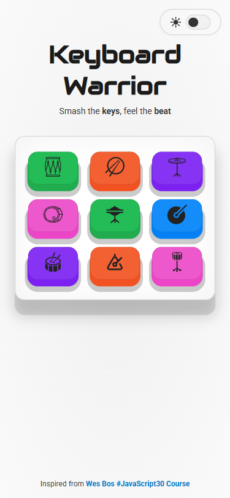
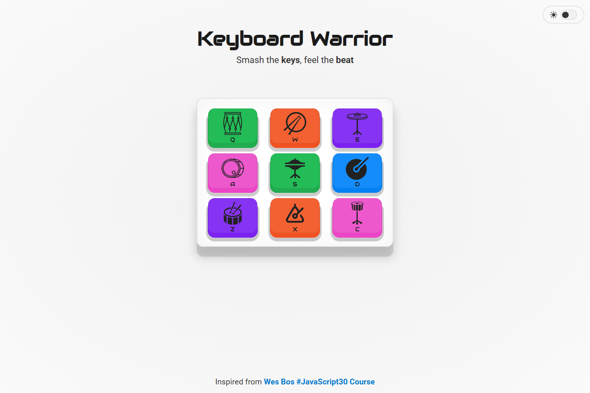
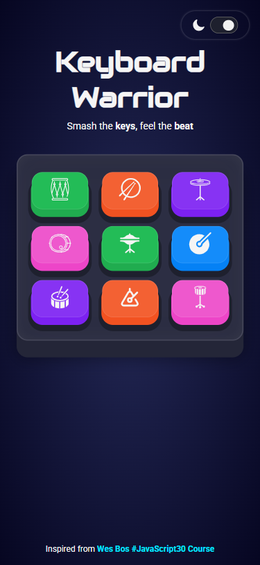
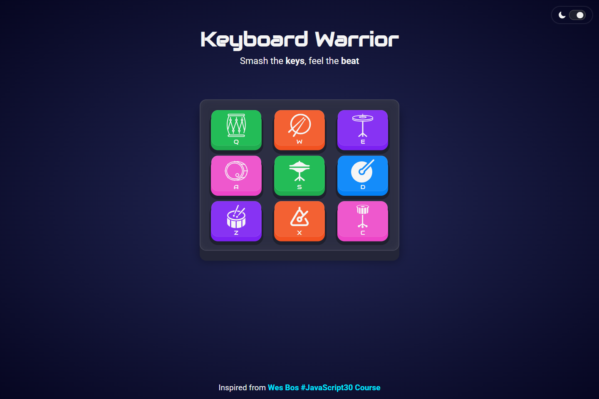
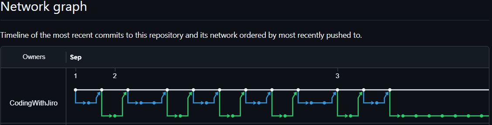

# 💻 PROJECT TITLE

## ℹ️ ADD PROJECT SUBTITLE

| _Mobile Preview (375x812)_                                   | _Desktop Preview (1440x960)_                                    |
| ------------------------------------------------------------ | --------------------------------------------------------------- |
|       |       |
|  |  |

INSERT A BRIEF DESCRIPTION OF THE PROJECT

<!-- FOR FRONTEND MENTOR PROJECTS ONLY -->

Created as part of the building challenges from [Frontend Mentor](https://www.frontendmentor.io/).

<!-- FOR FREECODECAMP LAB PROJECTS ONLY -->

Created as part of the lab challenges from [**freeCodeCamp.org**](https://www.freecodecamp.org/learn/full-stack-developer/) JavaScript course.

---

## 🔍 Overview

WHAT THIS PROJECT CONTAINS WITH 1-2 PARAGRAPHS WITH 2-3 SENTENCES EACH.

---

## ✨ Features

INSERT LIST OF PROJECT FEATURES

---

## 🔀 Development Workflow

> Click to view the full branch and merge history

This project adapts a [granular branching and commit workflow](https://github.com/CodingWithJiro/wesbos-js-30-drumkit/network) to simulate team collaboration. Each feature, fix, documentation, and chore is tracked in its own branch with descriptive commits.

Each [pull request](https://github.com/CodingWithJiro/wesbos-js-30-drumkit/pulls?q=is%3Apr+is%3Aclosed) I created contains a clear description, change list, screenshots for UI updates, and reviewer notes.

_This ensures I maintain a professional workflow, even as a solo developer._

---

## 🧠 What I Learned

INSERT LIST OF WHAT I LEARNED MAKING THIS PROJECT

---

## 🛠️ Tech Used

- HTML5
- CSS3
- JavaScript
- Git
- GitHub
- Netlify

---

## 🎨 Design Reference & Tools

- JPG design image
- Figma
- PerfectPixel

---

## 🚀 How to Run

1. Clone the repository
2. Open `index.html` in your browser

---

## 🌐 Live Demo

Or you can check out the 👉 [live website here](LINK)

---

## 📊 Performance Report

A **Google Lighthouse** audit was conducted on the final version of this project. You can view the full report [here](./assets/downloads/lighthouse-performance-report.pdf).

---

## 🧑‍💻 Author

Created by **Elmar Chavez**

🗓️ Month/Year: **September 2025**

📚 Journey: **6th** month of learning _frontend web development_.

<!--

DATES:

September 2025 = **6th**
October 2025 = **7th**
November 2025 = **8th**
December 2025 = **9th**

FRONTEND MENTOR TAGS:
html css javascript vscode git github netlify 5th-month frontend-mentor project perfectpixel lighthouse theme-toggle

FREECODECAMP TAGS:
html css javascript vscode git github netlify 5th-month freecodecamp project lighthouse theme-toggle fcc-js api

MERGE PULL REQUEST COMMENT SIMULATING PR APPROVAL FROM A TEAM:
In a team setting, this PR would await senior developer approval.
For this solo project, I’ll proceed with merging after review.

-->
